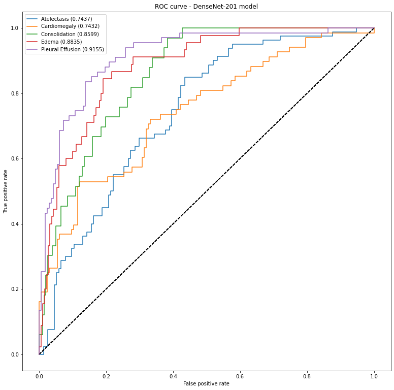
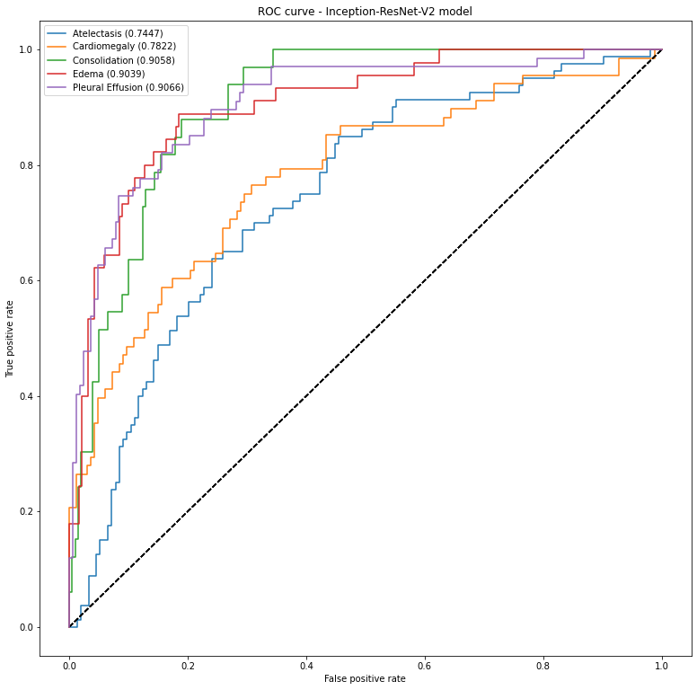
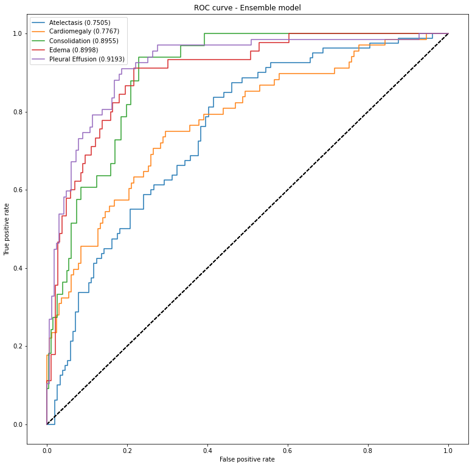

# CheXpert-multilabel-classification-tensorflow
__Operating System__: Ubuntu 18.04 (you may face issues importing the packages from the requirements.yml file if your OS differs).

Code repository for training multi-label classification models on the [CheXpert](https://stanfordmlgroup.github.io/competitions/chexpert/) [[1](#references)] Chest X-ray dataset containing 224,316 Chest X-ray images from Stanford Hospital containing 14 labels (5 labels for the competition).
The training set containing 223,316 Chest X-ray images and validation set containing 234 Chest X-ray images and the rest of the images being the official CheXpert competition test set.

Conducted operations on the dataset:
* The dataset was resized to image sizes 512x512 with maintained aspect ratio using this [script](https://github.com/tamerthamoqa/CheXpert-multilabel-classification-tensorflow/blob/master/misc/resize_image_folder_keep_aspect_ratio.py).
* A random __80/20 train/validation__ split was conducted on the training set in this [jupyter notebook](https://github.com/tamerthamoqa/CheXpert-multilabel-classification-tensorflow/blob/master/misc/creating_train_validation_csv_labels/creating_train_validation_labels_u-zeroes.ipynb): 178,731 Chest X-ray images for the training set, 44,683 Chest X-ray images for the validation set.
* The official validation set was used as the "test" set for the training experiments.
* __U-zeroes__ method was used on the dataset; all instances of the 'uncertain' label were mapped as zeroes.

A __DenseNet-201__ and __Inception-ResNet-V2__ multi-label classification convolutional neural network models were trained on the full 14 CheXpert labels:
* The default training hyperparameters in '_train_multilabel_classification_model.py_' were used.
* __Class weighted binary crossentropy loss__ training was used.
* The training set mean and standard deviation values were used to center and standardize the input images (__featurewise centering and standard deviation normalization__).
* An __Ensemble model__ was created from the trained models in this [jupyter notebook](https://github.com/tamerthamoqa/CheXpert-multilabel-classification-tensorflow/blob/master/testing_trained_models/creating_ensemble_model.ipynb) (Average Predictions Ensemble) and tested on the validation and "test" sets.

Please report any errors or issues. Feedback and suggestions would be greatly appreciated.

### Dataset Download
* CheXpert dataset original size (register your email and a download link will be sent as an email, ~450 GBs): [Official CheXpert Website](https://stanfordmlgroup.github.io/competitions/chexpert/)
* CheXpert dataset resized to 512x512 with maintained aspect ratio (__used in experiments__, ~ 45 GBs): [Drive](https://drive.google.com/file/d/1ir6kGK1yhqZZK5-2W0_JMawmcNZGc6r5/view?usp=sharing)


### Experiment Results
Calculating multilabel classification report, multilabel confusion matrix, ROC curve test metrics for the full 14 labels and the 5 compeition labels:
* Validation set: [jupyter notebook](https://github.com/tamerthamoqa/CheXpert-multilabel-classification-tensorflow/blob/master/testing_trained_models/calculating_test_metrics_on_validation_set.ipynb)
* "Test" set (official validation set): [jupyter notebook](https://github.com/tamerthamoqa/CheXpert-multilabel-classification-tensorflow/blob/master/testing_trained_models/calculating_test_metrics_on_official_chexpert_validation_set.ipynb)

### Official validation set ("test" set) ROC Curves for the five competition labels (Atelectasis, Cardiomegaly, Consolidation, Edema, Pleural Effusion):

### 1- DenseNet-201


### 2- Inception-ResNet-V2


### 3- Ensemble Model (Average Predictions Ensemble)


### Epoch history of best performing epoch per model
#### 1- DenseNet-201
```
    Epoch 27/30
    11171/11171 [==============================] - 7353s 658ms/step - loss: 1.3676 - auc: 0.8535 - binary_accuracy: 0.7630 - accuracy: 0.2744 - val_loss: 1.6275 - val_auc: 0.7947 - val_binary_accuracy: 0.7521 - val_accuracy: 0.2362

    Epoch 00027: val_auc improved from 0.78949 to 0.79468, saving model to densenet201.h5
```
#### 2- Inception-ResNet-V2
```
    Epoch 19/30
    11171/11171 [==============================] - 8441s 756ms/step - loss: 1.4735 - auc: 0.8223 - binary_accuracy: 0.7384 - accuracy: 0.2599 - val_loss: 1.5879 - val_auc: 0.7946 - val_binary_accuracy: 0.7441 - val_accuracy: 0.2496

    Epoch 00019: val_auc improved from 0.78585 to 0.79461, saving model to inceptionresnetv2.h5
```

### Training Model
```
    usage: train_multilabel_classification_model.py [-h] [--data_dir DATA_DIR]
                                                    [--model_architecture {densenet201,inceptionresnetv2,resnet152}]
                                                    [--train_multi_gpu TRAIN_MULTI_GPU]
                                                    [--num_gpus NUM_GPUS]
                                                    [--training_epochs TRAINING_EPOCHS]
                                                    [--resume_train RESUME_TRAIN]
                                                    [--optimizer {sgd,adam,nadam}]
                                                    [--lr LR]
                                                    [--use_nesterov_sgd USE_NESTEROV_SGD]
                                                    [--use_amsgrad_adam USE_AMSGRAD_ADAM]
                                                    [--batch_size BATCH_SIZE]
                                                    [--image_height IMAGE_HEIGHT]
                                                    [--image_width IMAGE_WIDTH]
                                                    [--num_workers NUM_WORKERS]
    
    Training CheXpert multi-label classification model.
    
    optional arguments:
      -h, --help            show this help message and exit
      --data_dir DATA_DIR   (Required) Path to the CheXpert dataset folder
                            (default: 'dataset/')
      --model_architecture {densenet201,inceptionresnetv2,resnet152}
                            The required model architecture for training:
                            ('densenet201','inceptionresnetv2', 'resnet152'),
                            (default: 'densenet201')
      --train_multi_gpu TRAIN_MULTI_GPU
                            If set to True, train model with multiple GPUs.
                            (default: False)
      --num_gpus NUM_GPUS   Set number of available GPUs for multi-gpu training, '
                            --train_multi_gpu' must be also set to True (default:
                            1)
      --training_epochs TRAINING_EPOCHS
                            Required training epochs (default: 30)
      --resume_train RESUME_TRAIN
                            If set to True, resume model training from model_path
                            (default: False)
      --optimizer {sgd,adam,nadam}
                            Required optimizer for training the model:
                            ('sgd','adam','nadam'), (default: 'nadam')
      --lr LR               Learning rate for the optimizer (default: 0.001)
      --use_nesterov_sgd USE_NESTEROV_SGD
                            Use Nesterov momentum with SGD optimizer: ('True',
                            'False') (default: False)
      --use_amsgrad_adam USE_AMSGRAD_ADAM
                            Use AMSGrad with adam optimizer: ('True', 'False')
                            (default: False)
      --batch_size BATCH_SIZE
                            Input batch size, if --train_multi_gpu then the
                            minimum value must be the number of GPUs (default: 16)
      --image_height IMAGE_HEIGHT
                            Input image height (default: 512)
      --image_width IMAGE_WIDTH
                            Input image width (default: 512)
      --num_workers NUM_WORKERS
                            Number of workers for fit_generator (default: 2)
```


### References:
* [1] Irvin, J.A., Rajpurkar, P., Ko, M., Yu, Y., Ciurea-Ilcus, S., Chute, C., Marklund, H., Haghgoo, B., Ball, R.L., Shpanskaya, K.S., Seekins, J., Mong, D.A., Halabi, S.S., Sandberg, J.K., Jones, R.H., Larson, D.B., Langlotz, C., Patel, B.N., Lungren, M.P., & Ng, A. (2019). CheXpert: A Large Chest Radiograph Dataset with Uncertainty Labels and Expert Comparison. AAAI. [arXiv](https://arxiv.org/abs/1901.07031)


### Hardware Specifications
* TITAN RTX Graphics Card (24 gigabytes Video RAM).
* i9-9900KF Intel CPU overclocked to 5 GHz.
* 32 Gigabytes DDR4 RAM at 3200 MHz.
